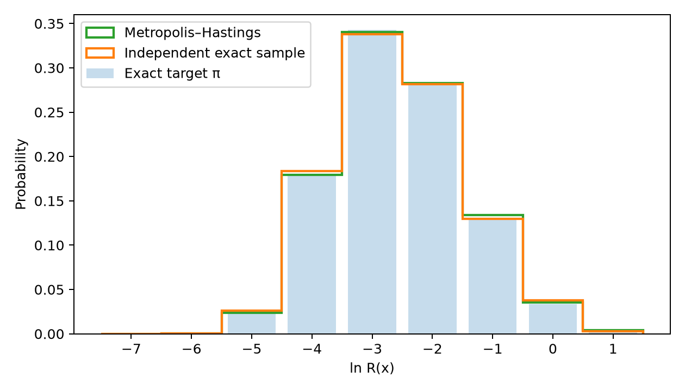
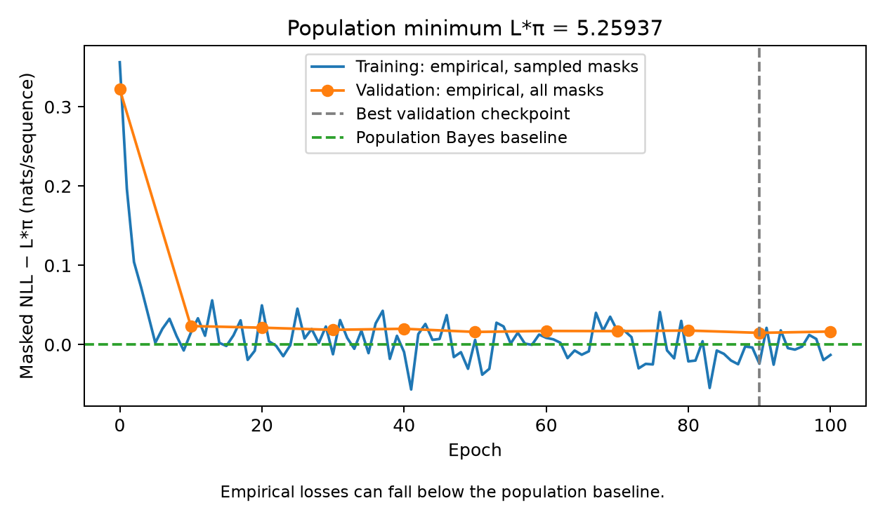
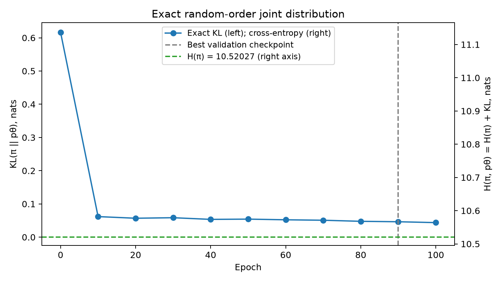
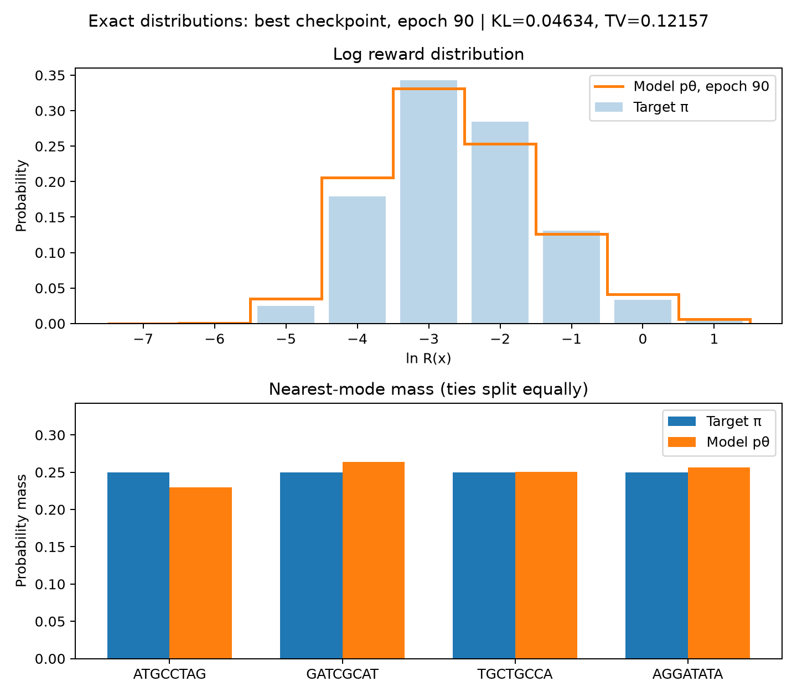

# Геном длины 8: Метрополис—Гастингс и masked MLP

Воспроизводимый эксперимент с алфавитом `A,C,G,T`, четырьмя модами и seed=42.
Конфигурация находится в `config.json`; зависимости управляются через `uv`.

## Результат полного запуска

Эксперимент выполнен на CPU с Python 3.14.7, JAX/JAXlib 0.11.2 и Optax 0.2.8.
Все **9 тестов прошли**, без skipped. Фактические версии также записаны в JSON-отчётах.

| Эпоха | Training loss | Точный validation loss | Точный KL(π‖pθ) |
|---:|---:|---:|---:|
| 0 | 5.615554 | 5.581524 | 0.616561 |
| 90, основной checkpoint | 5.235315 | 5.274226 | 0.046336 |
| 100, последний checkpoint | 5.246344 | 5.275858 | 0.043730 |

Все величины — в натах. Основная модель выбрана по validation loss, поэтому эпоха 100
с меньшим KL не заменяет согласованный `best.npz` эпохи 90. Максимальная ошибка
нормировки pθ среди оценённых эпох — `1.33×10⁻¹⁵`.

На графике `kl.png` слева показана шкала KL, справа — полной cross-entropy
`H(π,pθ)=H(π)+KL(π‖pθ)`. Пунктирная линия отмечает `H(π)=10.520268` на правой
шкале; её уровень соответствует нулю KL на левой. На эпохе 100 cross-entropy равна
`10.563997`, зазор до энтропии — `0.043730` нат. Равенство ещё не достигнуто.
Энтропия полной строки не является нижней границей masked NLL на `loss.png`.

На `loss.png` показан NLL после вычитания популяционного байесовского минимума:
`L*π=5.259372`. Он вычисляется по истинным условным распределениям π:

\[
L^*_\pi=\sum_{M\subseteq[8]}p^{|M|}(1-p)^{8-|M|}
\sum_{i\in M}H_\pi(X_i\mid X_{\bar M}).
\]

Это точное ожидание для независимых масок с p=0.5, а не H(π) или автоматически H(π)/2.
На эпохе 100 validation loss превышает эту величину на `0.016485` нат на строку;
на эпохе 90 — на `0.014854`. Нулевая граница относится к популяционному риску на π.
Training/validation loss измерены на конечных выборках; training дополнительно
использует случайные маски и меняющиеся внутри эпохи параметры. Поэтому отрицательные
значения этих эмпирических кривых после вычитания допустимы и не являются отрицательным KL.
В `training.json` исходные NLL сохранены без вычитания.

Сохранены 10 000 строк, прогрев 69 шагов и интервал 81. Фактическая доля принятия —
`0.701317`, стационарное ожидание — `0.700902`. TV после прогрева — `9.53×10⁻⁵`;
максимальная оценка корреляции выбранных статистик — `0.009779`.
Ошибка проверки стационарности — `2.17×10⁻¹⁹`, детального баланса — `1.69×10⁻²¹`.

| Сравнение с π | MCMC, 10 000 строк | Точная независимая выборка, 10 000 строк |
|---|---:|---:|
| TV гистограммы log reward | 0.005295 | 0.009701 |
| TV полного эмпирического распределения | 0.711641 | 0.713403 |
| Вес области моды 1, точный вес 0.25 | 0.249025 | 0.244825 |
| Вес области моды 2, точный вес 0.25 | 0.261908 | 0.249292 |
| Вес области моды 3, точный вес 0.25 | 0.242625 | 0.252475 |
| Вес области моды 4, точный вес 0.25 | 0.246442 | 0.253408 |

Это наблюдаемые результаты двух конечных выборок. Теоретическая корректность MH
проверяется отдельно через переходы; гистограммы служат эмпирической диагностикой.






`distribution.png` сравнивает точные π и pθ основного checkpoint эпохи 90:
гистограмму log reward и вероятностные массы областей мод. Вероятности получены
полным расчётом по 65 536 строкам с учётом всех порядков генерации, без шума
от выборки модели. Исходный `reward.png` отдельно показывает диагностику датасета MH.
Для основного checkpoint полная TV между π и pθ равна `0.121568`; совпадение
гистограмм reward само по себе не означает совпадение вероятностей всех строк.

## Окружение и запуск

По правилу рабочей папки **установку выполняет пользователь**. В проекте используется
уже установленный Python 3.14; команда не скачивает другой Python:

```bash
uv sync --python /usr/bin/python3 --no-python-downloads
```

После установки:

```bash
uv run --no-sync --offline --no-python-downloads python -m pytest
uv run --no-sync --offline --no-python-downloads python -m src run
uv run --no-sync --offline --no-python-downloads python -m src sample --context 'A??T????' --count 10
```

`run` выполняет генерацию и обучение. Также доступны отдельные `generate` и `train`,
`--config PATH`, а для `sample` — `--checkpoint PATH` и `--seed NUMBER`.
Без масок `sample` возвращает исходную строку. По умолчанию используется `best.npz`.
CLI выбирает CPU. Флаги `--no-sync --offline` исключают установку зависимостей при запуске.

Повторный `run` проверяет и использует существующий датасет. Существующие результаты
обучения защищены от перезаписи; `--overwrite` явно разрешает замену результатов
соответствующей команды. `run --overwrite` заново создаёт и данные, и модель.

`uv.lock`, создаваемый пользовательским `uv sync`, фиксирует версии зависимостей.
Проект запускается как Python-модуль из рабочей папки и не требует сборки собственного пакета.

## Распределение и данные

Моды: `ATGCCTAG`, `GATCGCAT`, `TGCTGCCA`, `AGGATATA`.
Матрица попарных расстояний:

```text
0 6 8 6
6 0 6 8
8 6 0 6
6 8 6 0
```

Для расстояния Хэмминга определены

\[
d(x)=\min_m\operatorname{dist}(x,m),\qquad
R(x)=e^{1-d(x)},\qquad
\pi_T(x)=\frac{R(x)^{1/T}}{\sum_y R(y)^{1/T}}.
\]

Согласованное значение — `T=1`. Эталон вычисляется перечислением всех `4⁸=65 536`
строк. Температура влияет на вероятности, а `log_reward` всегда равен `1-d(x)`.

Один запуск MH начинается из равномерно случайной строки. Предложение меняет одну
из восьми позиций на один из трёх других символов; поэтому `q(y|x)=q(x|y)=1/24`.
Вероятность принятия:

\[
\alpha(x,y)=\min\{1,\exp((d(x)-d(y))/T)\}.
\]

При отклонении сохраняется текущее состояние. Повторения необходимы для правильных
вероятностей. По детальному балансу `π(x)P(x,y)=π(y)P(y,x)` распределение π стационарно.
Каждое локальное изменение имеет положительную вероятность, пространство связно,
а отклонение предложения из моды даёт петлю. Поэтому цепь неприводима и апериодична.
Это обеспечивает эргодическую сходимость, но не задаёт её скорость.
См. [Hastings (1970)](https://probability.ca/hastings/hastings.pdf).

### Выбор прогрева и интервала

Матрица переходов хранится через 24 соседа и вероятность остаться. Численно проверяются
детальный баланс и `πP=π`. От равномерной μ₀ вычисляется `μₜ₊₁=μₜP`; прогрев — первый
шаг с `TV(μₜ,π)≤10⁻⁴`. Это проверка полного распределения, а не отдельного наблюдаемого.

Для интервала используются log reward и четыре веса принадлежности ближайшим модам.
При нескольких ближайших модах вес делится поровну. Для каждого наблюдаемого f
вычитается `Eπ f`, после чего выбирается первый L с

\[
\frac{\|P^L f\|_\pi}{\|f\|_\pi}\le0.01,
\qquad \|f\|_\pi^2=\sum_x\pi(x)f(x)^2.
\]

У стационарной цепи `Corr(f(X₀),f(Xₖ))=⟨f,Pᵏf⟩π/‖f‖π²`.
Оператор P сжимает норму L²(π) по неравенству Йенсена и стационарности π.
Из Коши—Буняковского следует ограничение абсолютной корреляции на **всех** k≥L.
Оно относится к указанным наблюдаемым и не доказывает независимость всех состояний.
После прогрева распределение близко к стационарному с указанной TV-погрешностью.

Для текущей конфигурации предварительно получены прогрев 69 и интервал 81; код
вычисляет их заново. Если критерий не достигнут за `diagnostic_limit` шагов, запуск
завершается ошибкой, а не подменяет критерий. Сохраняются 10 000 состояний после прогрева.

Диагностика сравнивает MCMC, независимую точную выборку такого же размера и π:
распределение расстояния, средний log reward, веса областей мод и TV полного эмпирического
распределения. При 10 000 наблюдениях на 65 536 состояниях полная эмпирическая TV может
быть большой даже для точной независимой выборки; это не ошибка семплера.

## Модель и обучение

Восемь символов кодируются one-hot по `A,C,G,T,MASK`: 40 входных чисел.
MLP `40→80→80→32` использует GELU, Glorot uniform для весов и нулевые смещения.
Количество параметров: `41×80 + 81×80 + 81×32 = 12 352`.
Logits имеют форму `(batch,8,4)`, softmax применяется отдельно на каждой позиции.

Датасет случайно делится на 9 000 training- и 1 000 validation-наблюдений.
Повторения не удаляются; одинаковое значение строки может встретиться в обеих частях,
как и при семплировании дискретного распределения с возвращением.
При каждом использовании training-строки позиции независимо маскируются с p=0.5:

\[
L_B=\frac1{|B|}\sum_{b\in B}\sum_{i:M_{bi}=1}
-\log q_{\theta,i}(x_{bi}\mid x_b^{masked}).
\]

Пустой набор масок даёт ноль. Все маски допустимы, включая восемь масок.
Adam: learning rate `10⁻³`, batch size 256, 100 эпох; training-часть перемешивается
каждую эпоху, последний неполный батч сохраняется. Обучение использует float32.
Training loss — взвешенное по числу строк среднее потерь батчей в течение эпохи;
параметры внутри эпохи меняются.

На эпохах 0,10,…,100 validation loss точно усредняется по всем 256 маскам каждой
validation-строки. Для p=0.5 каждая маска имеет вероятность 1/256.
Из этих эпох выбирается checkpoint с минимальным validation loss, включая эпоху 0;
равенство сохраняет более ранний checkpoint. Последняя модель сохраняется отдельно.

Masked NLL — proper log score условных распределений. На уровне популяционного риска
оптимальны истинные условные распределения π. Тогда любой порядок заполнения по правилу
цепочки даёт π. Конечный датасет, ограниченная MLP и оптимизация не гарантируют достижения
этого оптимума. Masked NLL и KL полного генератора — разные функционалы; их графики
могут меняться немонотонно.

## Точный KL генератора

Инференс выбирает оставшуюся маску равномерно, семплирует символ и повторяет шаг.
Известные символы сохраняются. Для KL генерация начинается из восьми масок.
Условные предсказания сети могут быть несовместимы с одним совместным распределением;
сам алгоритм генерации всё равно задаёт нормированное совместное pθ.

Пусть a(s) — вероятность прийти в частичную строку s, S — заполненные позиции,
а s₋ᵢ маскирует позицию i. Тогда

\[
a(\mathrm{MASK}^8)=1,\qquad
a(s)=\sum_{i\in S}\frac{a(s_{-i})q_{\theta,i}(s_i\mid s_{-i})}{8-|S|+1}.
\]

Все пути в s разбиваются по последней заполненной позиции. Поэтому для полной строки
`pθ(x)=a(x)` эта рекурсия суммирует все `8!` порядков с их вероятностями.
Используются `5⁸` частичных строк и предсказания для `5⁸−4⁸=325 089` строк с масками.
Предсказания вычисляются батчами; softmax, рекурсия в логарифмах и оценка выполняются
в NumPy float64. В том же наборе предсказаний вычисляется validation loss.

\[
KL(\pi\|p_\theta)=\sum_x\pi(x)(\log\pi(x)-\log p_\theta(x)).
\]

«Точный» означает полный перебор состояний и суммирование путей без Монте-Карло;
численные результаты имеют погрешность floating point. Нормировка проверяется до 10⁻¹⁰.
Вероятности не сглаживаются и KL не обрезается до нуля. Выбор лучшей модели использует
validation loss; KL известной π служит отдельной оценкой.

## Файлы и проверки

- `data/data8.parquet`: `sequence`, `distance`, `reward`, `log_reward`, `step`.
- `data/metadata.json`: конфигурация, версии окружения, прогрев/интервал, диагностика, SHA-256 датасета.
- `data/best.npz`, `data/last.npz`: параметры без pickle.
- `data/best_distribution.parquet`: все 65 536 строк с точными целевыми вероятностями,
  вероятностями и log probabilities основного checkpoint; эпоха записана в метаданных Parquet.
- `data/training.json`: конфигурация обучения, версии окружения, номер лучшей эпохи и исходные метрики.
- `plots/reward.png`, `plots/loss.png`, `plots/kl.png`.
- `plots/distribution.png`: сравнение целевого и обученного распределений.

Модули `src/` разделяют конфигурацию, данные, модель, оценку, обучение, графики и CLI.
Pydantic строго валидирует конфигурацию, метаданные и запросы. Массивы проверяются
на границах; внутри JIT — типизированные JAX-структуры. Несовпадающие метаданные или
checksum датасета останавливают загрузку.

Тесты сравнивают DP с полным перебором порядков на маленьком пространстве и проверяют
восстановление произвольного π из его истинных условных распределений. Также проверяются
MH, ожидание masked NLL, пустая маска и градиенты, параметры/размеры MLP, семплирование,
checkpoints и короткий полный эксперимент. Тесты, которым нужны JAX/Optax/PyArrow,
помечаются skipped при отсутствии зависимостей; это не считается полной проверкой.
