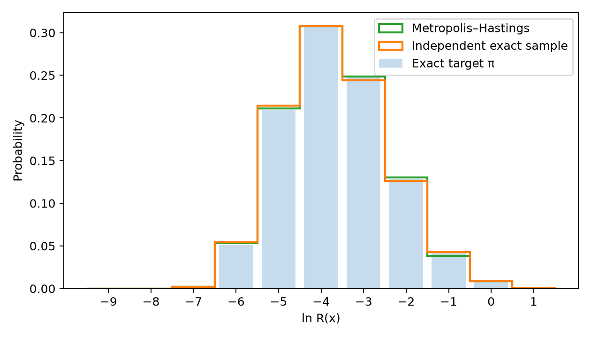
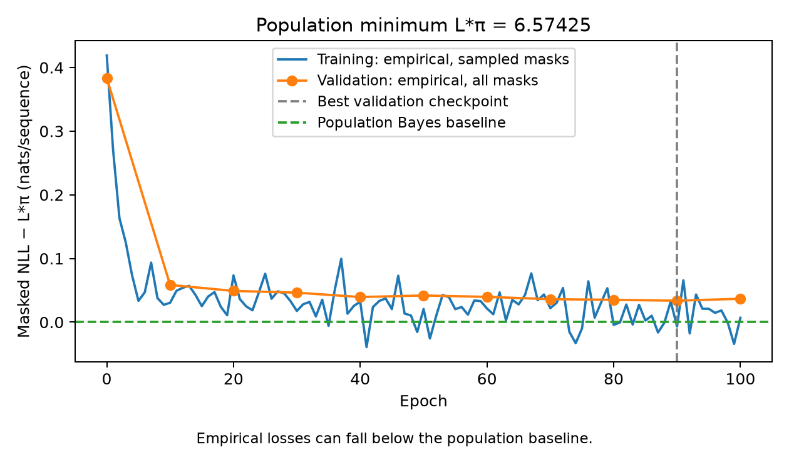
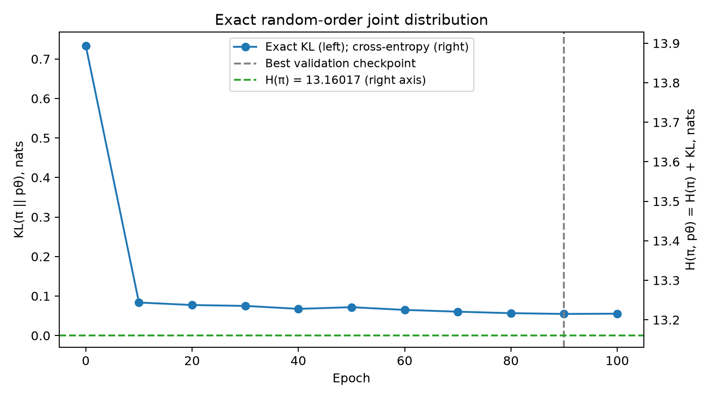
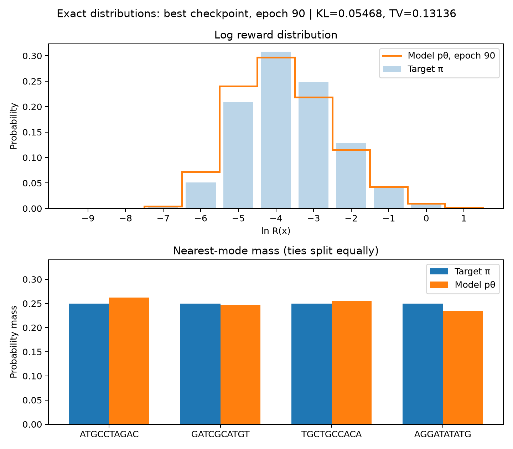

# Геном длины 10: Метрополис—Гастингс и masked MLP

Ветка `experiment/length-10`. Длина фиксирована в `src/config.py` (`LENGTH = 10`),
не является полем JSON-конфига. Исходная версия длины 8 с полным обучением и
артефактами сохранена на `main`, коммит `4fa92e3`; её описание — в
[README-length8.md](README-length8.md). Файлы `data/` и `plots/` верхнего уровня
относятся именно к длине 8. Новые результаты пишутся в `data/length10/` и `plots/length10/`.

## Результат полного запуска

Выполнены генерация 10 000 наблюдений и все 100 эпох обучения на CPU.
Проверены все 10 тестов: девять основных и отдельный тест много-блочного DP.

| Эпоха | Training NLL | Validation NLL | Точный KL(π‖pθ) |
|---:|---:|---:|---:|
| 0 | 6.993134 | 6.957486 | 0.733771 |
| 90, best | 6.567446 | 6.607987 | 0.054681 |
| 100 | 6.581149 | 6.610983 | 0.055296 |

Основной checkpoint — эпоха 90; полная TV(π,pθ) = `0.131363`.
H(π) = `13.160170`, популяционный минимум masked NLL L*π = `6.574253`.
Максимальная ошибка нормировки pθ — `2.22e-15`.
Распределение выучено приближённо: KL и TV положительны.

Прогрев 89 шагов, интервал 118; точный TV после прогрева
`9.50e-05`, максимальная L2-граница корреляции
`0.009977`. Фактическая доля принятия `0.700765`,
стационарное ожидание `0.700500`. Ошибки стационарности и
детального баланса: `1.90e-19` и `4.24e-22`.






## Отличия эксперимента

Моды: `ATGCCTAGAC`, `GATCGCATGT`, `TGCTGCCACA`, `AGGATATATG`.
К исходным четырём модам добавлены попарно различные в обеих позициях хвосты
`AC`, `GT`, `CA`, `TG`. Поэтому каждая попарная дистанция увеличилась на два:

```text
0  8 10  8
8  0  8 10
10 8  0  8
8 10  8  0
```

Это новое целевое распределение на десяти координатах; хвосты участвуют в reward.
Сохраняются определения `d(x) = min_j Hamming(x, mode_j)`, `R(x) = exp(1-d(x))`,
`π(x) = R(x)^(1/T)/Z`, температура 1 и seed 42.

MLP: `50→80→80→40`, one-hot по `A,C,G,T,MASK`, GELU, Glorot uniform и biases.
Число параметров: `51×80 + 81×80 + 81×40 = 13 800`.
Выход имеет форму `(batch,10,4)`.

Остальные настройки сохранены: 10 000 наблюдений одной MH-траектории,
разбиение 9000/1000, независимая маска p=0.5, Adam 0.001, batch 256, 100 эпох,
точная оценка на эпохах 0,10,…,100. Основной checkpoint выбирается по validation NLL;
последний сохраняется отдельно. Training loss — среднее суммы NLL скрытых позиций.
Validation loss усредняет все 1024 маски каждой validation-строки.

## Точные вычисления и память

Полных строк: `4^10 = 1 048 576`. Частичных: `5^10 = 9 765 625`.
KL(π‖pθ) вычисляется по всем полным строкам. Динамическая программа суммирует все
`10!` порядков раскрытия, выбирая равномерно следующую скрытую позицию.
Вероятности на каждом шаге берутся из соответствующего частичного контекста;
никакой фиксации порядка или оценки KL по выборке нет.

Таблица float64 условных log-probabilities занимает 3 125 000 000 байт.
Во время оценки она хранится во временном файле в папке результатов и отображается
через `numpy.memmap`; файл удаляется и при исключении. Нужны хотя бы 3.2 GB
свободного диска сверх результатов. Переходы MH применяются по столбцам,
а динамическая программа обрабатывает блоки по 65 536 контекстов. Математика
сохраняется, сокращается размер временных массивов. Точная оценка существенно
дороже, чем для длины 8.

MH меняет одну случайную позицию на одну из трёх других букв: `q=1/30`.
Приём: `min(1, exp((d_old-d_new)/T))`. Отказы сохраняют прежнее состояние.
Прогрев выбирается по точному TV между эволюцией равномерного начального закона и π,
порог `1e-4`. Интервал выбирается по L2(π)-границе 0.01 для центрированных log reward
и четырёх весов областей ближайших мод, с равным разделением ничьих.
Это граница корреляции этих наблюдаемых величин, не гарантия независимости строк.
Стационарность и детальный баланс проверяются непосредственно.

## Графики

`reward.png`: конечная MH-выборка и независимая точная выборка против π.
`kl.png`: точный KL слева, полная cross-entropy H(π,pθ)=H(π)+KL справа;
пунктир отмечает H(π). `distribution.png`: точные π и pθ основного checkpoint,
гистограмма log reward, массы областей, полная TV.

`loss.png`: эмпирические masked NLL за вычетом популяционного байесовского минимума
`L*π = Σ_M p^|M| (1-p)^(10-|M|) Σ_(i∈M) Hπ(X_i | X_(complement M))`.
Этот минимум рассчитывается по точным маргиналам π и не равен автоматически H(π)/2.
Эмпирические значения могут оказаться ниже популяционной границы; близость к нулю
не доказывает совпадение распределений. Raw NLL остаются в `training.json`.

## Запуск

Используется уже установленное окружение; команды ничего не устанавливают:

```bash
uv run --no-sync --offline --no-python-downloads python -m pytest
uv run --no-sync --offline --no-python-downloads python -m src run
uv run --no-sync --offline --no-python-downloads python -m src sample --context 'A??T??????' --count 10
```

При недоступных каталогах кеша можно добавить `--cache-dir /tmp/sirius-uv-cache`
после `uv run` и переменную `MPLCONFIGDIR=/tmp/sirius-matplotlib`.
Доступны также `generate`, `train`, `--config PATH`, `--checkpoint PATH`, `--seed NUMBER`.
Dataset: `data10.parquet`; отчёты: `metadata.json`, `training.json`; модели:
`best.npz`, `last.npz`; точные вероятности: `best_distribution.parquet`.
Повторный `run` проверяет существующий датасет; обучение защищено от перезаписи.
Для другого эксперимента нужно поменять обе папки результатов в копии конфига.
Зависимости зафиксированы в `uv.lock`; установку выполняет только пользователь.
