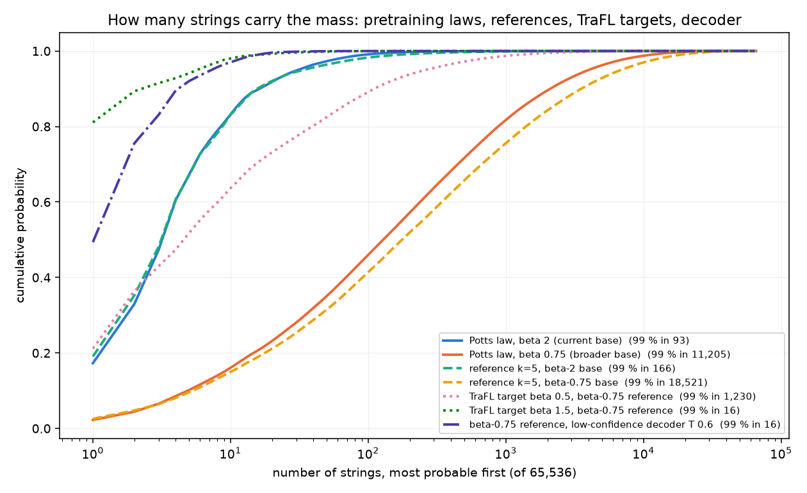

# TraFL and its baselines on length-8 DNA: report

Branch `port-baselines`. **Draft: grid 3 results pending (§4).** Every number below comes from a file in `results/`
or `models/`; exact quantities are computed over all 4⁸ = 65,536 strings and 5⁸ = 390,625 partial strings, not
sampled. Plan and caveats: `INTEGRATION_PLAN.md`, `PORT_NOTES.md`.

## 1. What is compared

The generator is a masked denoiser (MLP, or a transformer) that reveals one position per step.
- **Pretraining:** fit to Metropolis–Hastings samples of a Potts law.
- **Post-training:** toward log R = 3.5 (z_Potts + z_TFBind8). TFBind8 is wet-lab binding of every 8-mer; the Potts
  part is a synthetic pairwise energy.
- **TraFL's target:** p_ref(τ | x) e^{β r(y)}.

| Arm | What its loss scores | How | Target / anchor | Source |
|---|---|---|---|---|
| `trafl` (square, 32 IID / 4 comp masks) | string y | masked ELBO surrogate, Var / K penalty implicit | p_ref e^{βr}, path free | TraFL (this repo's port / the paper's pairs) |
| `trafl --estimator pairwise / split` | y | U-statistic of masked residuals (unbiased, no penalty) | same | bitseq thread |
| `trafl --estimator exact_masks / exact_lik` | y | exact ELBO / exact log p(y) | same | bitseq thread |
| `trafl --var-lambda` | y + order variance | explicit across-order variance penalty | path pulled toward c_ref | gfn_lab S2 fix |
| `espo`, `espo_ppo` | y | ELBO ratio + k2, PPO clip | k2 to p_ref | ESPO (TraFL's baseline) |
| `rspo` | y | ELBO log-ratio regressed on A / λ | implicit (λ) | RSPO |
| `tb` (= RTB), `db`, `subtb` | trajectory τ | exact log P(τ); per-step / sub-trajectory flow | P_ref e^{βr}, path c_ref | GFlowNet balance family |
| `entppo` | τ | soft-RL PPO with RTB's soft reward | P_ref e^{βr}, path c_ref | torchgfn `EntPPOGFlowNet` (adapted) |
| `grpo` | τ | policy gradient on the sampled path | none (max reward) | — |
| `justgrpo` | y via a left-to-right policy | token PPO, KL 0 | none | JustGRPO (TraFL's baseline) |

Rollouts are on-policy from the random-order generator (JustGRPO: left-to-right). `--rollout decoder` samples
training completions with the low-confidence-remasking decoder instead, as TraFL's paper does; this is only allowed
for the per-string arms. Exact metrics at every evaluation:
- terminal KL both ways to the reference, trajectory and path KL;
- score and entropy;
- left-to-right and low-confidence-decoder laws;
- diversity in TraFL's sense: E[distinct strings in 16 draws], overall and among the top 1 % by reward.

## 2. Is the base sound? (`results/foundation/`, figure `foundation.png`)

| | current base (Potts β 2) | broader base (Potts β 0.75) |
|---|---|---|
| pretraining law: strings for 99 % mass | 93 | 11,205 |
| MH sample: distinct strings | 160 (99.4 % of the law) | 2,398 (86 %) |
| reference k = 5: strings for 99 % | 166 | 18,521 |
| learned the law or stored the sample? | indistinguishable (sample = law) | learned: KL(law ‖ ref) 0.10 < KL(sample ‖ ref) 0.42; memorisation index 0.93 |
| TraFL target, strings for 99 %: β 0.5 / 1.5 / 4.5 | 33 / 8 / 1 | 1,230 / 16 / 1 |
| order imbalance KL(c_ref(τ\|y) ‖ uniform) | 0.04 nats | 0.08 nats |
| reference under the low-confidence decoder (T 0.6) | entropy 0.72, 99 % in a handful | entropy 1.58, 99 % in 16, half on one string |

**Verdict.**
- The current base (β 2) is weak for diversity and memorisation questions: its reference is effectively a 100-string
  law, and TraFL's target is a few strings.
- The broader base fixes both: the reference learns rather than stores, and TraFL's target spans about 1,200
  strings at β 0.5. Grid 3 runs on it.
- **On both bases, random-order paths given y are almost uniform.** A well-fit denoiser is nearly order-consistent,
  so "path-law" differences under the random-order sampler measure drift away from near-uniformity.
- The order structure that matters in practice comes from the decoder: confidence-ordered and near-deterministic,
  and already a strong mode-seeker at the reference.
- Readings about paths and diversity are therefore given per sampler.

## 3. Results on the current base (Potts β 2; reference k = 5; 2 seeds)

**Grid 1** (`results/port_grid1/READING.md`; β 1.5, 5,000 updates, all 11 configurations):
- up to terminal KL 1, every TraFL variant has TB's path KL (±7 %);
- the per-string excess appears only at KL 3;
- ESPO drifts at its stationary terminal law (path / terminal 0.08 → 1.6);
- score at matched KL(p ‖ p_ref) is identical across arms (±2 %);
- ESPO is the most diverse at matched KL; GRPO and RSPO lose diversity late;
- the decoder collapses every arm to one string.

**Grid 2, block A** (β ∈ {0.5, 1.5, 4.5}, 10,000 updates, TraFL ×2, TB, DB, SubTB, Ent-PPO). At β 0.5, where the
terminal law settles inside the band, path / terminal by update window:

| arm (β 0.5) | 40–251 | 251–1,585 | 1,585–10,001 |
|---|---|---|---|
| TraFL comp 4 | 0.072 | 0.171 | **0.541** |
| TraFL 32 IID | 0.071 | 0.154 | **0.252** |
| TB (RTB) | 0.061 | 0.053 | 0.036 |
| DB | 0.131 | 0.072 | 0.044 |
| SubTB | 0.067 | 0.065 | — |

- The per-string drift appears exactly where the terminal law is stationary.
- The balance arms move *back* toward the reference's path law.
- At terminal KL 3, TraFL's path KL is 0.37–1.22, against 0.21–0.29 for the four balance arms.
- Comp 4 drifts more than 32 IID at β 1.5, contrary to the variance identity's naive ordering.
- **Under the decoder (endpoints, `results/port_grid2/endpoints_block_a.csv`),** every arm's decoded law at update 10,000 is almost disjoint
  from the reference's (h² ≈ 0.98 at T 0.6) and concentrated on one string. No path comparison survives there on
  this base.
- Blocks B (penalty at β 4.5) and C (references k = 3, 7, transformer d32): kernel `ae-grid2-b`, pending.

**The 4-paired vs 32-independent puzzle** (`scripts/mask_penalty.py`, `mask_penalty.json`). The paper's 4 paired
masks drift more than this repo's 32 independent masks: late ratio 0.54 vs 0.25 at β 0.5. The hypothesis was that
pairing weakens the implicit penalty Var_masks(average); measured, it is refuted.

| on the policy trained by | 32 independent | 4 independent | 4 = 2 complementary pairs | single-mask σ² |
|---|---|---|---|---|
| TraFL 32 IID | 0.0033 | 0.026 | 0.013 | 0.104 |
| TraFL comp 4 | 0.0027 | 0.021 | 0.0086 | 0.085 |

Independent masks give σ²/K. Pairing halves the 4-mask penalty but leaves it 3–4× *larger* than 32 independent
masks, so the drift difference is not the penalty's size. Untested candidates:
- comp pairs never draw the full mask, so they estimate a truncated ELBO with a different fixed point (mean score
  0.063 vs 0.096 on the same completions);
- the anchor in gfn_lab's identity is the variance across *orders*, which a mask-average variance does not measure.

## 4. Results on the broader base (grid 3): pending

`results/port_grid3/SPEC.md` (54 runs; readings R1–R4 stated before running).

## 5. Correctness

- **Tests:** 94, each a mathematical identity or a comparison against an independent exact computation. Mutation
  checks: each new gate was made to fail by breaking its target.
- **Bit-for-bit continuity:** TraFL (`--arm trafl`, defaults) reproduces the pre-port code bit for bit.
- **Independent review** (Sonnet, read-only): no sign, normalisation or indexing error in the losses. It found and
  I fixed:
  - table rows overwritten when configurations differed only in shared settings;
  - the AR-decoder KL compared against the wrong reference law;
  - split / pairwise U-statistics biased under the dependent comp masks (now rejected);
  - matched interpolation dropping float-noise points;
  - SubTB NaN for empty trajectories;
  - β / u applied to the extensive `elbo` surrogate (a pre-existing line);
  - tests that only exercised ratio = 1 / λ = 1 (clipped branches and GAE λ < 1 now tested).

## 6. Limits

- One reward and one reference family per base; 2 seeds.
- The decoder here commits one token per step, with no top-p.
- Results speak to this toy, not to 8B models.
- Matched comparisons interpolate between checkpoints; the per-update x-axis mixes gradient steps for the
  multi-epoch arms (Ent-PPO μ 4, ESPO-PPO μ 8).
